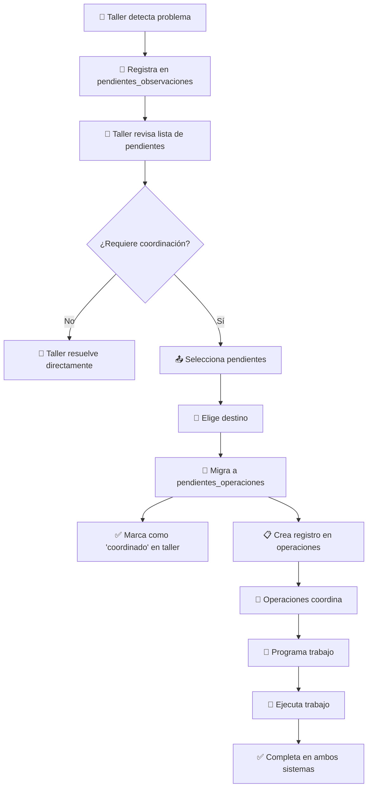

# 🔄 Sistema de Sinergia Taller-Operaciones

## 📋 Resumen del Sistema

Sistema completo que permite la coordinación fluida entre el **Taller** (reportes y problemas) y **Operaciones** (coordinación y programación), manteniendo la integridad de datos en ambos sistemas.

---

## 🎯 Arquitectura del Sistema

### **🛠️ Lado Taller** (`pendientes_observaciones`)
- **Propósito**: Reportar problemas encontrados en vehículos
- **Usuarios**: Personal de taller
- **Datos**: Problemas específicos, clasificaciones técnicas, descripción detallada
- **Estados**: `pendiente` → `en_progreso` → `completado` / `coordinado`

### **⚙️ Lado Operaciones** (`pendientes_operaciones`)
- **Propósito**: Coordinar recursos y programar trabajos
- **Usuarios**: Coordinadores de operaciones
- **Datos**: Destinos, tiempos estimados, programación, recursos
- **Estados**: `pendiente` → `programado` → `en_proceso` → `completado`

### **🔗 Puente de Sinergia**
- **Migración inteligente** de pendientes del taller a operaciones
- **Preservación de datos** en ambos sistemas
- **Trazabilidad completa** del flujo de trabajo
- **Flexibilidad de destinos** (Taller, IDISA, Taller Externo)

---

## 🔄 Flujo de Trabajo Completo



---

## 🗄️ Estructura de Datos

### **Tabla `pendientes_observaciones` (Taller)**
```sql
CREATE TABLE pendientes_observaciones (
  id_pendiente SERIAL PRIMARY KEY,
  id INTEGER NOT NULL,                    -- vehiculo_id
  clasificacion TEXT NOT NULL,            -- "Motor", "Transmisión", etc.
  subclasificacion TEXT,                  -- Detalle específico
  descripcion TEXT NOT NULL,              -- Descripción del problema
  prioridad TEXT CHECK (prioridad IN ('leve', 'medio', 'critico')),
  tiempo_estimado INTEGER,                -- Horas estimadas
  estado TEXT CHECK (estado IN ('pendiente', 'en_progreso', 'completado', 'coordinado')),
  coordinado_con TEXT,                    -- Destino de coordinación
  fecha_coordinacion TIMESTAMP,          -- Cuándo se coordinó
  -- ... otros campos
);
```

### **Tabla `pendientes_operaciones` (Operaciones)**
```sql
CREATE TABLE pendientes_operaciones (
  id SERIAL PRIMARY KEY,
  vehiculo_id INTEGER NOT NULL,
  interno INTEGER,                        -- Número interno del vehículo
  placa TEXT NOT NULL,                    -- Placa del vehículo
  trasladar_a TEXT DEFAULT 'Taller',     -- Destino del trabajo
  tiempo_estimado TEXT DEFAULT '4-6 horas', -- Tiempo en formato texto
  motivo TEXT,                           -- Razón del trabajo
  criticidad TEXT CHECK (criticidad IN ('leve', 'medio', 'critico')),
  estado TEXT CHECK (estado IN ('pendiente', 'programado', 'en_proceso', 'completado')),
  es_automatico BOOLEAN DEFAULT true,     -- true=sistema, false=manual
  -- ... campos técnicos adicionales
);
```

---

## ⚙️ Funciones SQL del Sistema

### **1. 🔄 Migración Individual**
```sql
SELECT migrar_pendiente_a_operaciones(
  p_id_pendiente := 123,
  p_trasladar_a := 'IDISA'
);
```

**¿Qué hace?**
- Valida que el pendiente existe y está activo
- Verifica que no exista duplicado en operaciones
- Convierte datos del formato taller al formato operaciones
- Crea registro en `pendientes_operaciones`
- Marca original como `coordinado`

### **2. 📦 Migración Masiva**
```sql
SELECT migrar_pendientes_masivos(
  p_ids_pendientes := ARRAY[123, 124, 125],
  p_trasladar_a := 'Taller'
);
```

**¿Qué hace?**
- Procesa múltiples pendientes en una transacción
- Retorna resumen de éxitos y fallos
- Maneja errores individuales sin afectar el batch

### **3. ↩️ Rollback de Migración**
```sql
SELECT deshacer_migracion_pendiente(
  p_interno := 74,
  p_trasladar_a := 'IDISA'
);
```

**¿Qué hace?**
- Elimina registro de `pendientes_operaciones`
- Restaura estado original en `pendientes_observaciones`
- Útil para corrección de errores

### **4. 📊 Estadísticas de Coordinación**
```sql
SELECT estadisticas_coordinacion_pendientes();
```

**Retorna**:
- Total de pendientes por estado
- Distribución por destino de coordinación
- Métricas de prioridad
- Análisis temporal

---

## 🖥️ Interface de Usuario

### **📋 Lista de Pendientes (Taller)**
**Ubicación**: `/vehiculos/lista-pendientes`

**Características**:
- ✅ **Filtros avanzados**: Por flota, estado, prioridad
- ✅ **Selección múltiple**: Checkboxes para bulk actions
- ✅ **Modal de migración**: Selector de destino intuitivo
- ✅ **Estados visuales**: Iconografía clara para coordinados
- ✅ **Feedback en tiempo real**: Loading states y confirmaciones

**Flujo de Uso**:
1. Taller ve lista de problemas reportados
2. Selecciona problemas que requieren coordinación
3. Click "Enviar a Operaciones"
4. Elige destino (Taller / IDISA / Taller Externo)
5. Confirma migración
6. Sistema procesa y actualiza estados

### **⚙️ Coordinación de Operaciones**
**Ubicación**: `/pendientes`

**Características**:
- ✅ **Vista consolidada**: Automáticos + Manuales
- ✅ **Identificación clara**: Marca origen (AUTO vs MANUAL)
- ✅ **Gestión de estados**: Programación y seguimiento
- ✅ **Datos técnicos**: Porcentajes de vida útil
- ✅ **Edición directa**: Tiempos, destinos, observaciones

---

## 🔧 API Endpoints

### **POST `/api/migrar-pendiente`**
**Migración Individual**:
```json
{
  "tipo": "individual",
  "id_pendiente": 123,
  "trasladar_a": "IDISA"
}
```

**Migración Masiva**:
```json
{
  "tipo": "masivo",
  "ids_pendientes": [123, 124, 125],
  "trasladar_a": "Taller"
}
```

**Respuesta**:
```json
{
  "success": true,
  "message": "Migración exitosa",
  "resultado": {
    "interno": 74,
    "placa": "ABC123",
    "trasladar_a": "IDISA",
    "tiempo_estimado": "4-6 horas"
  }
}
```

### **GET `/api/migrar-pendiente`**
**Estadísticas de Coordinación**:
```json
{
  "success": true,
  "estadisticas": {
    "total_pendientes": 45,
    "pendientes_activos": 12,
    "pendientes_coordinados": 8,
    "coordinacion_por_destino": {
      "Taller": 5,
      "IDISA": 2,
      "Taller Externo": 1
    }
  }
}
```

---

## 🛡️ Validaciones y Protecciones

### **✅ Validaciones de Migración**
- **Existencia**: Pendiente debe existir y estar activo
- **Duplicados**: No crear duplicados en mismo destino
- **Estados**: Solo migrar pendientes no completados
- **Datos requeridos**: Validar integridad de vehículo

### **🔒 Protecciones de Datos**
- **Preservación**: Datos originales nunca se pierden
- **Trazabilidad**: Timestamps y audit trails completos
- **Rollback**: Capacidad de deshacer migraciones
- **Integridad**: Foreign keys y constraints

### **⚡ Optimizaciones**
- **Índices**: Para consultas rápidas por estado
- **Batch processing**: Migraciones masivas eficientes
- **Cacheo**: Estadísticas pre-calculadas
- **Logs**: Monitoreo y debugging completo

---

## 📊 Casos de Uso Prácticos

### **🔧 Caso 1: Problema Menor (Taller → Taller)**
```
Problema: Luz check engine intermitente
Flujo: Taller detecta → Taller migra a "Taller" → Operaciones programa → Taller resuelve
```

### **🏭 Caso 2: Reparación Mayor (Taller → IDISA)**
```
Problema: Transmisión requiere overhaul
Flujo: Taller detecta → Taller migra a "IDISA" → Operaciones coordina traslado → IDISA repara
```

### **🔧 Caso 3: Especialidad Externa (Taller → Taller Externo)**
```
Problema: Sistema eléctrico complejo
Flujo: Taller detecta → Taller migra a "Taller Externo" → Operaciones busca especialista → Externo repara
```

### **📦 Caso 4: Múltiples Problemas**
```
Situación: 5 vehículos necesitan service programado
Flujo: Taller selecciona todos → Migración masiva a "Taller" → Operaciones programa batch
```

---

## 🚀 Beneficios del Sistema

### **Para el Taller**:
- ✅ **Reportes simplificados**: Focus en detectar problemas
- ✅ **Coordinación automática**: No gestionar recursos externos
- ✅ **Trazabilidad**: Seguimiento de todo el proceso
- ✅ **Flexibilidad**: Múltiples destinos según necesidad

### **Para Operaciones**:
- ✅ **Vista consolidada**: Todo en una sola interfaz
- ✅ **Información rica**: Contexto técnico + logístico
- ✅ **Programación eficiente**: Batch processing y optimización
- ✅ **Control total**: Edición de tiempos y destinos

### **Para la Organización**:
- ✅ **Eficiencia operativa**: Menos coordinación manual
- ✅ **Visibilidad completa**: KPIs y métricas en tiempo real
- ✅ **Escalabilidad**: Sistema maneja volúmenes crecientes
- ✅ **Integridad de datos**: Audit trail completo

---

## 🔧 Instalación y Configuración

### **1. Ejecutar Scripts SQL en Supabase**:
```sql
-- Orden de ejecución:
1. sql/agregar_estado_coordinado.sql
2. sql/funcion_migrar_pendiente_a_operaciones.sql
```

### **2. Verificar Funciones**:
```sql
-- Test básico
SELECT estadisticas_coordinacion_pendientes();

-- Test de migración (con datos reales)
SELECT migrar_pendiente_a_operaciones(ID_REAL, 'Taller');
```

### **3. Configurar Permisos**:
```sql
-- Asegurar que las funciones son ejecutables por la aplicación
GRANT EXECUTE ON FUNCTION migrar_pendiente_a_operaciones TO authenticated;
GRANT EXECUTE ON FUNCTION migrar_pendientes_masivos TO authenticated;
GRANT EXECUTE ON FUNCTION estadisticas_coordinacion_pendientes TO authenticated;
```

### **4. Deploy de la Aplicación**:
```bash
# Los cambios ya están commiteados
git push origin main

# Vercel desplegará automáticamente
```

---

## 🎯 Próximos Pasos Opcionales

### **Mejoras Futuras**:
1. **📊 Dashboard de métricas**: Visualización avanzada de coordinación
2. **📱 Notificaciones**: Alerts automáticos por estado
3. **🤖 IA predictiva**: Sugerencias de destino según historial
4. **📋 Reportes automáticos**: Consolidados semanales/mensuales
5. **🔄 Sincronización bidirecional**: Updates automáticos entre sistemas

### **Integraciones**:
1. **📧 Email notifications**: Alerts a responsables por destino
2. **📅 Calendario integrado**: Programación visual avanzada
3. **📊 Analytics**: KPIs y métricas de performance
4. **🔗 API externa**: Integración con sistemas de terceros

---

**🎉 El sistema está listo y operativo. La sinergia entre Taller y Operaciones es ahora fluida, trazable y eficiente!**