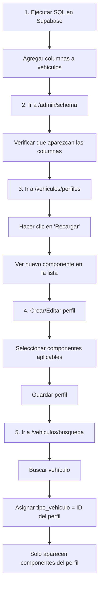

# Flujo: Schema → Perfiles → Vehículos

## Resumen

El sistema tiene 3 niveles que trabajan juntos de forma dinámica:

1. **Schema** - Define qué columnas existen en la tabla `vehiculos`
2. **Perfiles** - Configura qué componentes aplican a cada tipo de vehículo
3. **Vehículos** - Muestra solo los campos del perfil asignado

---

## 1. Schema (`/admin/schema`)

### ¿Qué hace?
Gestiona la **estructura de la tabla** `vehiculos` en la base de datos.

### Funciones principales:
- ✅ Muestra **todas las columnas** que existen actualmente
- ✅ Detecta componentes automáticamente siguiendo el patrón `{componente}_{tipo}`
- ✅ Genera SQL para agregar nuevas columnas
- ✅ Identifica columnas faltantes (componentes incompletos)
- ✅ Reconoce alias configurados

### Ejemplo:
Si quieres agregar un nuevo componente "Filtro de Partículas":

```sql
-- Ejecutar en Supabase SQL Editor
ALTER TABLE public.vehiculos ADD COLUMN IF NOT EXISTS filtro_particulas_km integer;
ALTER TABLE public.vehiculos ADD COLUMN IF NOT EXISTS filtro_particulas_fecha date;
ALTER TABLE public.vehiculos ADD COLUMN IF NOT EXISTS filtro_particulas_modelo text;
ALTER TABLE public.vehiculos ADD COLUMN IF NOT EXISTS filtro_particulas_intervalo integer;
```

Después de ejecutar el SQL:
- Las columnas aparecen en `/admin/schema` ✅
- El componente aparece en `/vehiculos/perfiles` cuando recargas ✅

---

## 2. Perfiles (`/vehiculos/perfiles`)

### ¿Qué hace?
Configura **qué componentes aplican** a cada tipo de vehículo.

### Comportamiento dinámico:
- 📊 Lee las columnas de la tabla `vehiculos` en tiempo real
- 🔄 Actualiza la lista de componentes al hacer clic en "Recargar"
- ✨ Los componentes aparecen/desaparecen según la tabla

### Flujo de uso:

#### 1. Cargar componentes disponibles
```javascript
// Al abrir la página o hacer clic en "Recargar"
cargarComponentesDinamicos()
  → Lee columnas de 'vehiculos'
  → Detecta patrones {componente}_{tipo}
  → Carga alias desde id=999998
  → Agrupa por categorías
  → Muestra en UI
```

#### 2. Crear perfil
```
Ejemplo: "Mercedes Bus Escolar"

Seleccionar componentes:
☑ Aceite Motor
☑ Filtro Aceite Motor
☑ Filtro Combustible
☑ Filtro Aire
☑ Batería
☑ Neumáticos
☐ Filtro Cabina (no aplica para buses)

Guardar → componentes_aplicables: [
  "aceite_motor",
  "filtro_aceite_motor",
  "filtro_combustible",
  "filtro_aire",
  "bateria",
  "neumatico_modelo_marca"
]
```

#### 3. Asignar perfil a vehículo
En `/vehiculos/busqueda`:
- Buscar vehículo por placa
- Campo `tipo_vehiculo` = ID del perfil
- Guardar

---

## 3. Vehículos (`/vehiculos/busqueda`)

### ¿Qué hace?
Muestra **solo los campos** del perfil asignado al vehículo.

### Filtrado dinámico:
```javascript
// Cargar perfil del vehículo
configuracion = await cargarConfiguracion(vehiculo.tipo_vehiculo)
// configuracion = ["aceite_motor", "filtro_combustible", ...]

// Filtrar componentes
function filtrarComponentesAplicables(componenteId) {
  if (!configuracion || configuracion.length === 0) return true // Mostrar todo
  return configuracion.includes(componenteId) // Solo los del perfil
}

// Aplicar filtro a cada sección
<ComponenteInput
  fields={allFields.filter((_, idx) =>
    filtrarComponentesAplicables(componentIds[idx])
  )}
/>
```

### Ejemplo visual:

**Vehículo: Mercedes Bus (tipo_vehiculo = 3)**
- Perfil 3 incluye: `["aceite_motor", "filtro_combustible", "bateria"]`

**Resultado en búsqueda:**
```
✅ Aceite Motor
   - KM: _____
   - Fecha: _____
   - Intervalo: _____

✅ Filtro Combustible
   - KM: _____
   - Fecha: _____
   - Modelo: _____

✅ Batería
   - KM: _____
   - Fecha: _____
   - Modelo: _____

❌ Filtro Cabina (no aparece porque no está en el perfil)
```

---

## Diagrama de flujo completo



---

## Casos especiales

### Componentes con alias

**Problema:**
Tienes `intervalo_cambio_aceite` que no sigue el patrón estándar.

**Solución:**
1. Ir a `/admin/alias`
2. Configurar:
   - Nombre Real: `intervalo_cambio_aceite`
   - Componente: `aceite_motor`
   - Tipo: `intervalo`
3. Guardar

**Resultado:**
- En Schema: aparece como `aceite_motor` con alias
- En Perfiles: aparece como "Aceite Motor" (incluye intervalo_cambio_aceite)
- En Vehículos: funciona normalmente

### Exclusiones

**Columnas que NO son de mantenimiento:**
1. Ir a `/admin/exclusiones`
2. Marcar columnas administrativas:
   - ✅ `id` (excluida)
   - ✅ `placa` (excluida)
   - ✅ `created_at` (excluida)
3. Guardar

**Resultado:**
- En Schema: no aparecen
- En Perfiles: no aparecen
- En Vehículos: no afecta (son campos fijos)

---

## Preguntas frecuentes

### ¿Qué pasa si agrego columnas nuevas en SQL?
1. Las columnas aparecen automáticamente en `/admin/schema`
2. En `/vehiculos/perfiles` haces clic en "Recargar"
3. Los nuevos componentes aparecen disponibles para seleccionar
4. Los perfiles existentes NO se modifican (debes editarlos manualmente)

### ¿Qué pasa si elimino columnas de la tabla?
1. Desaparecen de `/admin/schema`
2. Desaparecen de `/vehiculos/perfiles` al recargar
3. Los perfiles que las tenían seleccionadas siguen con el ID (pero no funcionan)
4. ⚠️ **Cuidado**: puede romper perfiles existentes

### ¿Los perfiles se actualizan automáticamente?
**No**. Los perfiles son **configuraciones fijas** que defines manualmente.

Si agregas un componente nuevo:
- ✅ Aparece disponible en la lista
- ❌ NO se agrega automáticamente a perfiles existentes
- 👉 Debes editar cada perfil y agregarlo manualmente

### ¿Cómo funciona el botón "Recargar" en perfiles?
```javascript
// Hace una nueva consulta a la tabla vehiculos
const { data } = await supabase.from('vehiculos').select('*').limit(1)
const columnas = Object.keys(data)

// Procesa columnas nuevamente
// Detecta componentes
// Actualiza la UI
```

**Cuándo usarlo:**
- ✅ Después de ejecutar SQL en schema
- ✅ Después de configurar nuevos alias
- ✅ Después de cambiar exclusiones
- ✅ Para verificar cambios en la estructura

---

## Flujo recomendado para agregar un componente nuevo

### Paso 1: Planificar
```
Componente: "Filtro DPF"
Campos:
- filtro_dpf_km (integer)
- filtro_dpf_fecha (date)
- filtro_dpf_modelo (text)
- filtro_dpf_intervalo (integer)
```

### Paso 2: Crear en base de datos
Ir a Supabase SQL Editor:
```sql
ALTER TABLE public.vehiculos ADD COLUMN IF NOT EXISTS filtro_dpf_km integer;
ALTER TABLE public.vehiculos ADD COLUMN IF NOT EXISTS filtro_dpf_fecha date;
ALTER TABLE public.vehiculos ADD COLUMN IF NOT EXISTS filtro_dpf_modelo text;
ALTER TABLE public.vehiculos ADD COLUMN IF NOT EXISTS filtro_dpf_intervalo integer;

COMMENT ON COLUMN public.vehiculos.filtro_dpf_km IS 'Kilometraje al último cambio de Filtro DPF';
```

### Paso 3: Verificar en Schema
1. Ir a `/admin/schema`
2. Buscar "filtro_dpf" en la tabla
3. Verificar que tenga ✅ en KM, Fecha, Modelo, Intervalo

### Paso 4: Actualizar perfiles
1. Ir a `/vehiculos/perfiles`
2. Clic en "Recargar" (botón verde)
3. Editar cada perfil que necesite el componente
4. Marcar ☑ Filtro DPF
5. Guardar

### Paso 5: Verificar en vehículos
1. Ir a `/vehiculos/busqueda`
2. Buscar un vehículo con el perfil actualizado
3. Verificar que aparezca "Filtro DPF" en la sección correcta

---

## Resumen del sistema dinámico

| Componente | Fuente de datos | Se actualiza |
|------------|-----------------|--------------|
| **Schema** | Columnas de tabla `vehiculos` | Al recargar página |
| **Perfiles** | Componentes detectados dinámicamente | Al hacer clic en "Recargar" |
| **Vehículos** | Perfil asignado (`tipo_vehiculo`) | Al cargar vehículo |

**Ventaja principal:**
✨ **No necesitas modificar código** para agregar componentes, solo ejecutar SQL y recargar.

**Limitación:**
⚠️ Los perfiles existentes deben editarse manualmente para incluir nuevos componentes.
