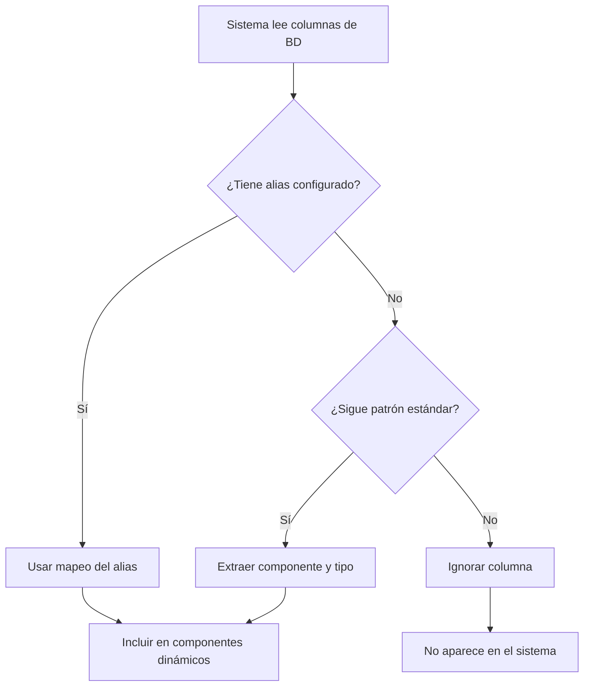

# Sistema de Alias de Columnas

## Índice
- [¿Qué son los alias?](#qué-son-los-alias)
- [¿Por qué son necesarios?](#por-qué-son-necesarios)
- [Cómo funcionan](#cómo-funcionan)
- [Configuración visual](#configuración-visual)
- [Ejemplos prácticos](#ejemplos-prácticos)
- [Implementación técnica](#implementación-técnica)

---

## ¿Qué son los alias?

Los **alias de columnas** son mapeos que permiten al sistema reconocer columnas de la base de datos con nombres que **no siguen el patrón estándar**.

### Patrón estándar esperado

El sistema espera que todas las columnas de mantenimiento sigan este patrón:

```
{componente}_{tipo}
```

**Ejemplos válidos:**
- `aceite_motor_km` → Componente: "aceite_motor", Tipo: "km"
- `aceite_motor_fecha` → Componente: "aceite_motor", Tipo: "fecha"
- `aceite_motor_intervalo` → Componente: "aceite_motor", Tipo: "intervalo"
- `filtro_combustible_km` → Componente: "filtro_combustible", Tipo: "km"

### Problema con nombres no estándar

Algunas columnas existentes tienen nombres diferentes:

❌ **Nombres problemáticos:**
- `intervalo_cambio_aceite` (no termina en `_intervalo`)
- `intervalo_cambio_aceite_hr` (no sigue el patrón)
- `intervalo_rotacion_neumaticos` (no sigue el patrón)

El sistema **no puede reconocer** estas columnas automáticamente porque no siguen el patrón `{componente}_{tipo}`.

---

## ¿Por qué son necesarios?

### Sin alias

Cuando el sistema encuentra `intervalo_cambio_aceite`:

1. ❌ No termina en `_km`, `_fecha`, `_intervalo`, etc.
2. ❌ No puede extraer el nombre del componente
3. ❌ La columna es **ignorada**
4. ❌ No aparece en perfiles ni en la búsqueda de vehículos

### Con alias

Cuando configuras el alias:

```
Nombre Real:  intervalo_cambio_aceite
Componente:   aceite_motor
Tipo:         intervalo
```

El sistema hace:

1. ✅ Reconoce `intervalo_cambio_aceite`
2. ✅ Lo mapea a componente "aceite_motor" tipo "intervalo"
3. ✅ Lo trata como si fuera `aceite_motor_intervalo`
4. ✅ Aparece en todas las funcionalidades del sistema

---

## Cómo funcionan

### Flujo del sistema



### Proceso detallado

1. **Lectura de columnas:**
   ```typescript
   columnas = ['intervalo_cambio_aceite', 'aceite_motor_km', 'placa']
   ```

2. **Cargar alias desde BD:**
   ```typescript
   alias = [
     {
       nombre_real: 'intervalo_cambio_aceite',
       componente: 'aceite_motor',
       tipo: 'intervalo'
     }
   ]
   ```

3. **Procesamiento:**
   - `intervalo_cambio_aceite` → ✅ Tiene alias → Componente: "aceite_motor", Tipo: "intervalo"
   - `aceite_motor_km` → ✅ Patrón estándar → Componente: "aceite_motor", Tipo: "km"
   - `placa` → ❌ Está en exclusiones → Ignorar

4. **Resultado:**
   ```typescript
   componentes = {
     'aceite_motor': {
       id: 'aceite_motor',
       label: 'Aceite Motor',
       fields: {
         intervalo: 'intervalo_cambio_aceite',  // Desde alias
         km: 'aceite_motor_km'                   // Patrón estándar
       }
     }
   }
   ```

---

## Configuración visual

### Acceso a la interfaz

Hay dos formas de acceder:

1. **Desde `/admin/schema`:**
   - Clic en el botón amarillo "Configurar Alias"

2. **Directamente:**
   - Navegar a `/admin/alias`

### Agregar un nuevo alias

1. Clic en "Agregar Alias"
2. Completar los campos:

   | Campo | Descripción | Ejemplo |
   |-------|-------------|---------|
   | **Nombre Real de la Columna** | El nombre exacto de la columna en la BD | `intervalo_cambio_aceite` |
   | **Componente** | Nombre base del componente (sin sufijo) | `aceite_motor` |
   | **Tipo de Campo** | Qué tipo de dato representa | `intervalo` |

3. Ver la vista previa del mapeo:
   ```
   intervalo_cambio_aceite → aceite_motor_intervalo
   ```

4. Clic en "Guardar Configuración"

### Eliminar un alias

- Clic en "Eliminar" junto al alias que quieres borrar
- Clic en "Guardar Configuración"

### Restaurar valores por defecto

- Clic en "Restaurar Defecto"
- Confirmar la acción
- Esto restaura los 3 alias predefinidos del sistema

---

## Ejemplos prácticos

### Ejemplo 1: Intervalo de cambio de aceite

**Problema:**
Tienes una columna `intervalo_cambio_aceite` que no sigue el patrón.

**Solución:**

1. Ir a `/admin/alias`
2. Agregar alias:
   - Nombre Real: `intervalo_cambio_aceite`
   - Componente: `aceite_motor`
   - Tipo: `intervalo`
3. Guardar

**Resultado:**
- El sistema ahora reconoce esta columna
- Aparece en el componente "Aceite Motor"
- Se puede usar en perfiles de vehículos
- Se muestra en la búsqueda de vehículos

### Ejemplo 2: Intervalo por horas

**Problema:**
Tienes `intervalo_cambio_aceite_hr` para vehículos que usan horas en lugar de km.

**Solución:**

1. Agregar alias:
   - Nombre Real: `intervalo_cambio_aceite_hr`
   - Componente: `aceite_motor`
   - Tipo: `intervalo`
2. Guardar

**Resultado:**
- Ambas columnas (`intervalo_cambio_aceite` e `intervalo_cambio_aceite_hr`) se mapean al mismo componente
- El sistema las trata como parte de "Aceite Motor"

### Ejemplo 3: Columna personalizada

**Escenario:**
Agregaste una columna `mantenimiento_general` que no sigue el patrón.

**Pasos:**

1. Ir a `/admin/alias`
2. Agregar alias:
   - Nombre Real: `mantenimiento_general`
   - Componente: `mantenimiento`
   - Tipo: `fecha`
3. Guardar

**Ahora:**
- `mantenimiento_general` se trata como `mantenimiento_fecha`
- Aparece en los componentes dinámicos

---

## Implementación técnica

### Almacenamiento

Los alias se guardan en la tabla `configuraciones_vehiculo` con un ID especial:

```sql
-- ID reservado para alias del sistema
id = 999998
nombre_configuracion = '__ALIAS_SISTEMA__'
componentes_aplicables = [
  {
    "nombre_real": "intervalo_cambio_aceite",
    "componente": "aceite_motor",
    "tipo": "intervalo"
  },
  ...
]
```

### Estructura de datos

```typescript
export type AliasColumna = {
  nombre_real: string       // Nombre exacto en la BD
  componente: string        // Nombre base del componente
  tipo: 'km' | 'fecha' | 'modelo' | 'intervalo' | 'litros' | 'hr'
}
```

### Funciones principales

#### `cargarAlias()`
Carga los alias desde la base de datos.

```typescript
const alias = await cargarAlias()
// Retorna: AliasColumna[]
```

#### `guardarAlias(alias)`
Guarda los alias en la base de datos.

```typescript
await guardarAlias([
  {
    nombre_real: 'intervalo_cambio_aceite',
    componente: 'aceite_motor',
    tipo: 'intervalo'
  }
])
```

#### `convertirAliasARecord(alias)`
Convierte el array de alias a un objeto para búsqueda rápida.

```typescript
const aliasRecord = convertirAliasARecord(alias)
// Retorna:
// {
//   'intervalo_cambio_aceite': {
//     componente: 'aceite_motor',
//     tipo: 'intervalo'
//   }
// }
```

### Integración en el sistema dinámico

**En `componentes-dinamicos.ts`:**

```typescript
export async function cargarComponentesDinamicos() {
  // 1. Cargar alias desde BD
  const aliasArray = await cargarAlias()
  const COLUMNAS_ALIAS = convertirAliasARecord(aliasArray)

  // 2. Procesar cada columna
  columnas.forEach(col => {
    // Primero verificar si tiene alias
    if (COLUMNAS_ALIAS[col]) {
      const alias = COLUMNAS_ALIAS[col]
      nombreComponente = alias.componente
      tipoColumna = alias.tipo
    }
    // Luego verificar patrón estándar
    else if (col.endsWith('_km')) {
      nombreComponente = col.replace('_km', '')
      tipoColumna = 'km'
    }
    // ... más patrones
  })
}
```

### Archivos involucrados

| Archivo | Propósito |
|---------|-----------|
| `src/lib/alias-columnas.ts` | Lógica de carga/guardado de alias |
| `src/app/admin/alias/page.tsx` | Interfaz visual para configurar alias |
| `src/lib/componentes-dinamicos.ts` | Usa alias al cargar componentes |
| `src/app/admin/schema/page.tsx` | Usa alias al analizar schema |

---

## Alias por defecto

El sistema viene con 3 alias preconfigurados:

```typescript
[
  {
    nombre_real: 'intervalo_cambio_aceite',
    componente: 'aceite_motor',
    tipo: 'intervalo'
  },
  {
    nombre_real: 'intervalo_cambio_aceite_hr',
    componente: 'aceite_motor',
    tipo: 'intervalo'
  },
  {
    nombre_real: 'intervalo_rotacion_neumaticos',
    componente: 'rotacion_neumaticos',
    tipo: 'intervalo'
  }
]
```

Estos se pueden:
- ✅ Modificar
- ✅ Eliminar
- ✅ Restaurar con "Restaurar Defecto"

---

## Preguntas frecuentes

### ¿Cuándo debo usar un alias?

Usa un alias cuando:
- Tienes una columna existente con nombre legacy
- No puedes renombrar la columna en la BD
- La columna no sigue el patrón `{componente}_{tipo}`

### ¿Puedo mapear múltiples columnas al mismo componente?

✅ Sí. Ejemplo:
- `intervalo_cambio_aceite` → `aceite_motor.intervalo`
- `intervalo_cambio_aceite_hr` → `aceite_motor.intervalo`

Ambas se reconocen como parte del componente "Aceite Motor".

### ¿Qué pasa si borro un alias que está en uso?

- La columna ya no será reconocida por el sistema
- No aparecerá en perfiles ni búsquedas
- Los datos en la BD permanecen intactos

### ¿Los alias afectan el rendimiento?

No. Los alias se cargan una sola vez cuando el sistema lee las columnas.

### ¿Puedo renombrar una columna en lugar de usar alias?

Sí, pero:
- ⚠️ Requiere modificar la BD con SQL
- ⚠️ Puede romper datos existentes
- ✅ Los alias son más seguros y no invasivos

---

## Mejores prácticas

1. **Documenta tus alias:**
   - Anota por qué creaste cada alias
   - Indica si es temporal o permanente

2. **Usa nombres descriptivos:**
   - Componente: `aceite_motor` ✅
   - Componente: `am` ❌

3. **Revisa periódicamente:**
   - Ve a `/admin/alias` cada cierto tiempo
   - Elimina alias obsoletos

4. **Prefiere el patrón estándar:**
   - Para columnas nuevas, usa `{componente}_{tipo}`
   - Reserva los alias solo para columnas legacy

5. **Mantén sincronizados:**
   - Si renombras una columna en BD, actualiza el alias
   - O elimina el alias si ya no es necesario
